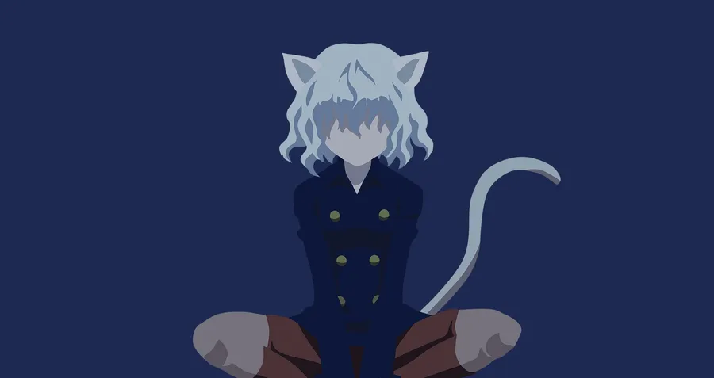

<!-- BANNER -->

  

<h1 align="center">Hola 👋, soy Pablo</h1>
<h3 align="center">Especialista en Nen | Desarrollador | Fan de Neferpitou</h3>

  

---

## 🕷️ Sobre mí

  

- 🔭 Trabajo en **proyectos personales y académicos**
- 🌱 Aprendiendo **programación de sistemas, redes y simulación**
- 👯 Abierto a colaborar en **proyectos complejos o experimentales**
- 💬 Pregúntame sobre **C, Linux, Docker, Unity**
- ⚡ Dato curioso: *Mi Nen sería de tipo Especialista*

---

## 🧠 Habilidades (Nen)

  

- 💻 **Lenguajes:** C, C++, Java, Python  
- 🐧 **Sistemas:** Linux (Xubuntu), Windows  
- 🔧 **Herramientas:** Git, Docker, Unity, QEMU  
- 🌐 **Redes:** SSH, Samba, CUPS  

---

## 🏹 Estadísticas de GitHub

  

  

---

## 📫 Contacto

  

---

  

⭐ *“Yo nací para proteger al Rey.”* — Neferpitou
