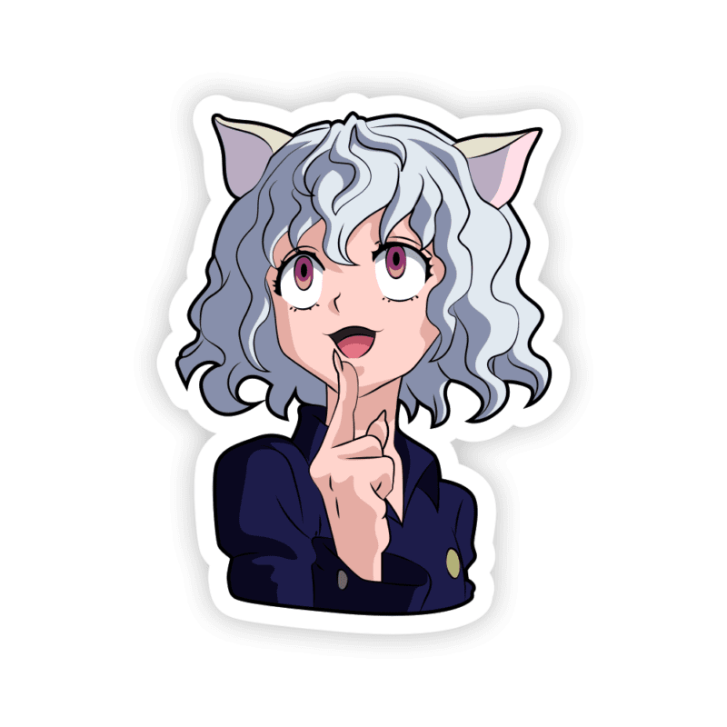
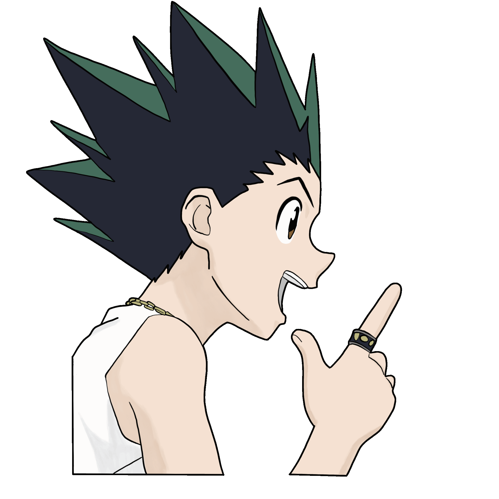
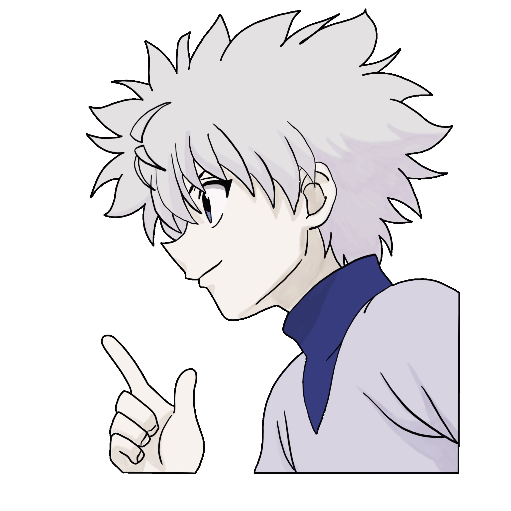

<!-- BANNER -->

  

<h1 align="center">Hola 👋, soy Pablo </h1>
<h3 align="center">Tecnico en Informatica| Desarrollador | Fan de Hunter X Hunter</h3>

  

---

## 🕷️ Sobre mí

  
  

       
    - 🔭 Trabajo en **proyectos personales y académicos**  
    - 🌱 Aprendiendo **programación de sistemas, redes y simulación**  
    - 👯 Abierto a colaborar en **proyectos complejos o experimentales**  
    - 💬 Pregúntame sobre **C#, Linux**
  

 

---

## 🧠 Habilidades

  
  

       
    • 💻 <b>Lenguajes:</b> C#, C++, Java 
    • 🐧 <b>Sistemas:</b> Linux (Debian), Windows 
    • 🔧 <b>Herramientas:</b> Git, Docker, Unity 
    • 🌐 <b>Redes:</b> SSH, Samba
  

 

---
<!--## 🛠️ Trabajos Participados

  

--- -->

## 🏹 Estadísticas de GitHub

  

---
## 📫 Contacto

  
  

---

  
  

⭐ *“Disfruta los desvíos. En ellos encontrarás cosas más importantes que lo que buscas.”* — Ging Freecss
